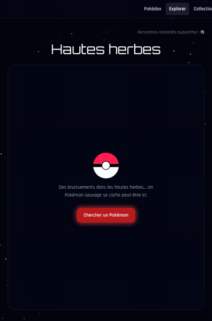
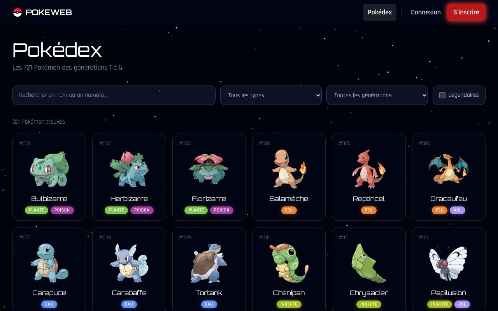
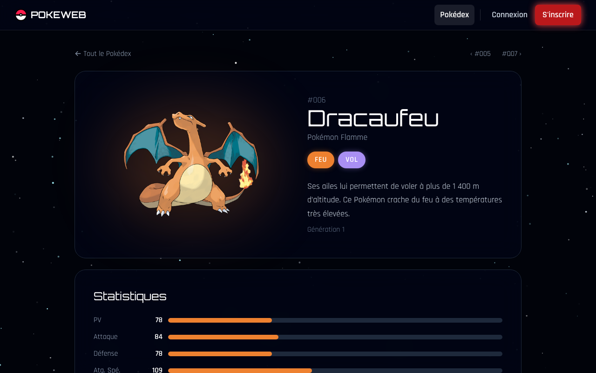
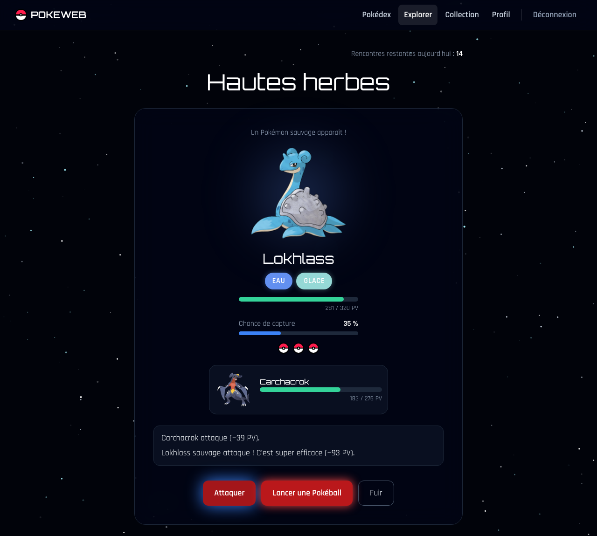
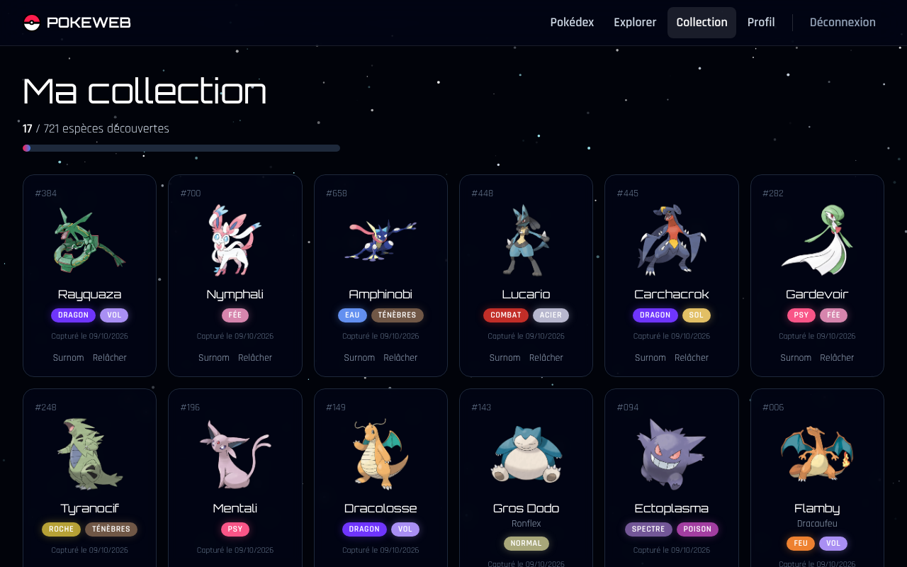
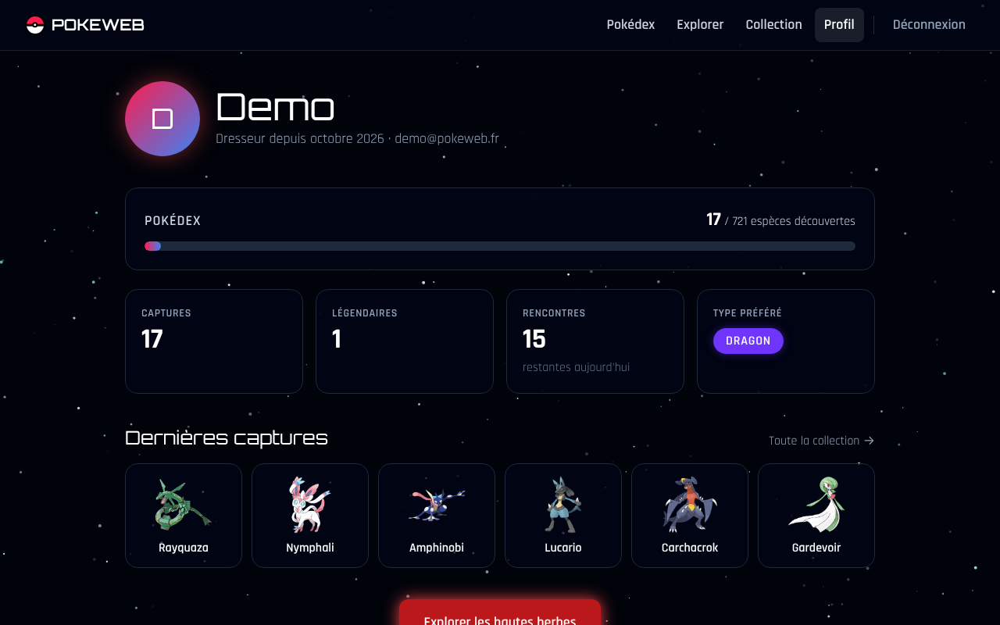
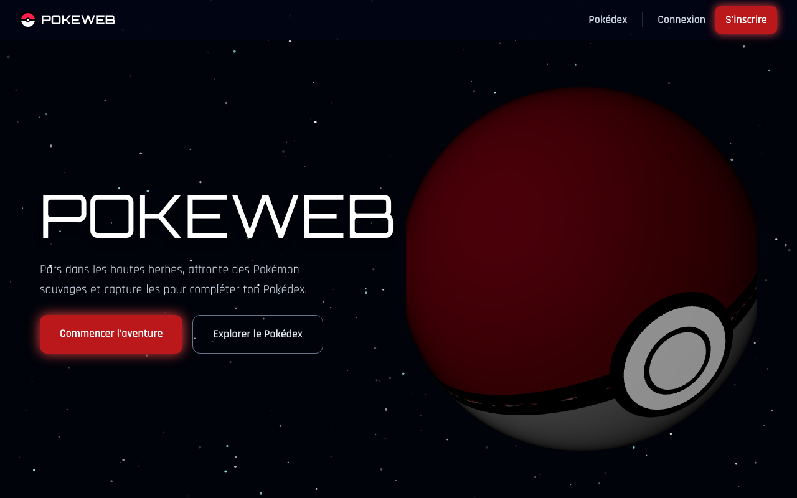
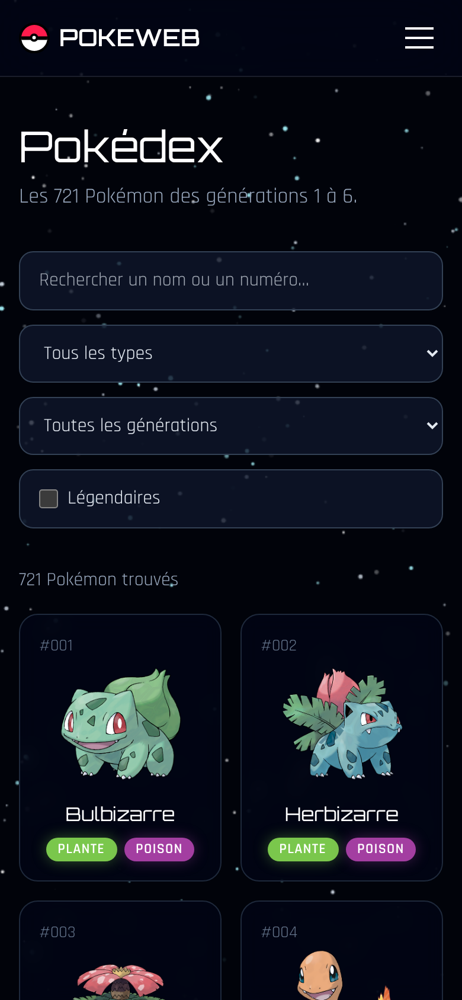
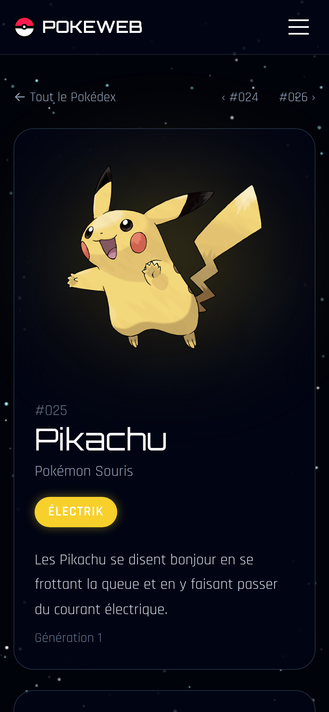

# PokeWeb

[](https://github.com/NIKAerer/PokeWeb/actions/workflows/ci.yml)

Jeu web de collection Pokémon : explore les hautes herbes, affronte des Pokémon sauvages au tour par tour, capture-les et complète ton Pokédex.

Projet personnel réalisé pour mon portfolio (BTS SIO SLAM), avec une **API Symfony** et une **interface React**.

**Démo en ligne :** https://poke-web-umber.vercel.app (API : https://pokeweb-api.onrender.com/api)
**Compte de démo :** `demo@pokeweb.fr` / `pokeweb-demo` (ou le bouton « Essayer avec le compte de démo » sur la page de connexion).



## Ce que l'on peut faire

- **Parcourir le Pokédex** : les 721 Pokémon des générations 1 à 6, en français, avec recherche (sans tenir compte des accents), filtres par type, génération et légendaires, et une fiche détaillée avec les statistiques.
- **Explorer** : 15 rencontres par jour avec un Pokémon sauvage. Les légendaires n'apparaissent que dans 2 % des rencontres.
- **Combattre** : envoyer un Pokémon de sa collection. Combat au tour par tour basé sur les vraies statistiques et la table des types : le plus rapide attaque en premier.
- **Capturer** : 3 Pokéballs par rencontre. La chance dépend de la force du Pokémon et augmente quand il est affaibli, mais un Pokémon K.O. ne peut plus être capturé.
- **Gérer sa collection** : donner un surnom, relâcher un Pokémon, suivre sa progression.
- **Profil** : pseudo, date d'inscription, espèces découvertes, légendaires, type préféré et dernières captures.

| Pokédex | Fiche d'un Pokémon |
|---|---|
|  |  |

| Combat | Collection |
|---|---|
|  |  |

| Profil | Accueil |
|---|---|
|  |  |

Le site est responsive :

<p>
  
  
</p>

## Stack technique

| Partie | Technologies |
|---|---|
| Backend | PHP 8.3, Symfony 7.3, API Platform 4 (Pokédex en lecture seule), Doctrine ORM et migrations, SQLite |
| Authentification | JWT avec LexikJWTAuthenticationBundle, mots de passe hachés, CORS avec NelmioCorsBundle |
| Frontend | React 18, React Router, Vite, Tailwind CSS, Axios, Three.js (Pokéball 3D de l'accueil) |
| Tests | PHPUnit (backend), Vitest et Testing Library (frontend) |
| Qualité | ESLint, GitHub Actions (lint, tests et build à chaque push) |
| Déploiement | Docker (FrankenPHP) sur Render pour l'API, Vercel pour le front |

## Organisation du code

```
PokeWeb/
├── pokeweb-backend/              API Symfony
│   ├── src/Controller/           Inscription, profil, rencontres, collection
│   ├── src/Service/              Règles du jeu : CaptureService, BattleService, TypeChart
│   ├── src/Entity/               User, Pokemon, PokemonUser (capture), Encounter (rencontre)
│   ├── src/Dto/                  Données reçues par l'API, avec leurs règles de validation
│   ├── src/Command/              Import du Pokédex, compte de démo
│   ├── data/pokemons.csv         Le Pokédex (721 Pokémon, noms et descriptions en français)
│   ├── migrations/               Évolutions de la base de données
│   └── tests/                    Tests PHPUnit
├── pokeweb-frontend/             Interface React
│   ├── src/pages/                Une page par écran
│   ├── src/components/           Composants réutilisables (carte, barre de PV, navigation…)
│   ├── src/api/client.js         Client HTTP : ajoute le token, gère son expiration
│   └── src/auth/session.js       Lecture et validité du token JWT
├── docs/screenshots/             Captures du README
└── render.yaml                   Déploiement de l'API sur Render
```

### Quelques choix techniques

- **La logique du jeu est dans des services**, pas dans les contrôleurs : les contrôleurs reçoivent la requête et renvoient le JSON, `CaptureService` et `BattleService` appliquent les règles. C'est ce qui rend les règles faciles à tester.
- **Le hasard est passé en paramètre** (`throwBall($encounter, roll: 0.0)`, `computeDamage(..., randomFactor: 1.0)`) : en production il est tiré au sort, dans les tests il est fixé pour obtenir toujours le même résultat.
- **Un joueur ne peut toucher qu'à ses propres Pokémon** : la capture est toujours cherchée avec l'id **et** le joueur connecté. Changer l'id dans l'URL renvoie une erreur 404 (vérifié par un test).
- **Les données reçues sont validées par des DTO** (`#[MapRequestPayload]` et contraintes `Assert`) avec des messages d'erreur en français.
- **Aucun secret dans le dépôt** : `APP_SECRET`, la passphrase et les clés JWT sont dans `.env.local` (ignoré par Git) en local, et générés par Render en production.

### Les règles en chiffres

- **Chance de capture de base** = `1,2 − total des stats / 600`, divisée par 3 pour un légendaire, toujours entre 5 % et 80 %. Elle est multipliée par `2 − PV restants / PV max` (jusqu'à presque ×2) et plafonnée à 90 %.
- **Dégâts** : formule officielle simplifiée au niveau 50, attaque de puissance 60, meilleure statistique d'attaque (physique ou spéciale) et meilleur type de l'attaquant, avec un facteur aléatoire entre 0,85 et 1.
- **PV en combat** = `PV × 2 + 60`.

## Lancer le projet en local

Prérequis : PHP 8.2 ou plus (avec les extensions `pdo_sqlite` et `sodium`), Composer, Node.js 22.

### 1. Backend

```bash
git clone https://github.com/NIKAerer/PokeWeb.git
cd PokeWeb/pokeweb-backend
composer install

# Secrets locaux, jamais commités
echo "APP_SECRET=$(openssl rand -hex 16)" > .env.local
echo "JWT_PASSPHRASE=$(openssl rand -hex 16)" >> .env.local
php bin/console lexik:jwt:generate-keypair

# Base de données, Pokédex et compte de démo
php bin/console doctrine:migrations:migrate --no-interaction
php bin/console app:import-pokemons
php bin/console app:demo

php -S 127.0.0.1:8001 -t public
```

L'API répond sur http://127.0.0.1:8001/api (la documentation API Platform est sur http://127.0.0.1:8001/api/docs).

### 2. Frontend

```bash
cd ../pokeweb-frontend
npm install
npm run dev
```

Le site est sur http://localhost:3000. Pour viser une autre API, copier `.env.example` en `.env.local` et changer `VITE_API_URL`.

## Tests

```bash
# Backend : 32 tests (règles du jeu, API, compte de démo)
cd pokeweb-backend
php bin/console lexik:jwt:generate-keypair --env=test   # une seule fois
php bin/phpunit

# Frontend : 16 tests (session, navigation, connexion, utilitaires)
cd ../pokeweb-frontend
npm test
```

La CI GitHub Actions lance ces tests, ESLint, les migrations sur une base vide et le build à chaque push et pull request.

## Mise en ligne

- **API sur Render** (offre gratuite, image Docker) : sur Render, *New > Blueprint*, choisir ce dépôt. Le fichier `render.yaml` crée le service et génère `APP_SECRET` et `JWT_PASSPHRASE`. Render demande `CORS_ALLOW_ORIGIN`, l'adresse du front sous forme d'expression régulière, par exemple `^https://pokeweb-xxx\.vercel\.app$`.
- **Front sur Vercel** (offre Hobby gratuite) : importer le dépôt, choisir `pokeweb-frontend` comme dossier racine et définir `VITE_API_URL` avec l'adresse de l'API Render suivie de `/api`. `vercel.json` renvoie toutes les adresses vers `index.html` pour que React Router fonctionne.

Limites de l'offre gratuite de Render, assumées pour une démo :

- le serveur s'endort après 15 minutes sans visite et met environ une minute à se réveiller (le site l'indique pendant le chargement) ;
- le disque est effacé à chaque redémarrage : la base est recréée au démarrage (`docker/entrypoint.sh`), avec le Pokédex et le compte de démo remis à zéro. Les comptes créés sur la démo ne sont donc pas conservés.

## Limites connues et idées pour la suite

Ce qui n'existe pas (encore) :

- XP, niveaux, évolutions, arènes et badges ;
- combats et échanges entre joueurs, classement ;
- mot de passe oublié et confirmation de l'email ;
- une base PostgreSQL pour garder les comptes en production.

L'idée de départ du projet (une ville à construire, des zones à explorer par téléportation, de la survie) reste une piste pour une version suivante.

## Crédits

- Données du Pokédex et illustrations officielles : [PokéAPI](https://pokeapi.co/) (projet open source).
- Pokémon et les noms des Pokémon sont des marques de Nintendo, Game Freak et The Pokémon Company. Ce projet est un projet étudiant non commercial.
